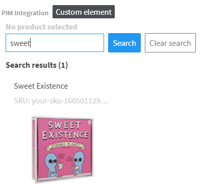

# Crystallize product selector for Kentico Kontent

This repository contains source code of Crystallize product selector custom element for Kentico Kontent.



## Setup

1. Create your account in the [Crystallize](https://crystallize.com/) service.
1. Deploy the code to a secure public host.
    * See the [deploying section](#deploying) for a really quick option.
1. Follow the instructions in the [Kentico Kontent documentation](https://docs.kontent.ai/tutorials/develop-apps/integrate/content-editing-extensions#a-displaying-your-custom-editor-in-kentico-kontent) to add the element to a content model.
    * The `Hosted code URL` is where you deployed to in step 1.
    * Configure the JSON parameters as detailed in the [JSON Parameters section](#json-parameters).

## JSON Parameters

You will also need to provide the following JSON parameters for the custom element to connect to your Crystallize tenant. Replace the placeholders with the actual values from the Shopify admin UI:

```json
{
    "tenantId": "<TENANT ID>",
    "disableModificationOfExternalItems": true
}
```

The *disableModificationOfExternalItems* parameter is optional and allows for a different behavior for items created by a possible integration that creates an item in Kontent when a product is created in Crystallize. The value of the custom element contains an *isExternal* property in that case. If the *isExternal* is set to true, the selector is shown in a mode that doesn't allow for a further change of its value.

## Deploying

Netlify has made this easy. If you click the deploy button below, it will guide you through the process of deploying it to Netlify and leave you with a copy of the repository in your GitHub account as well.

[](https://app.netlify.com/start/deploy?repository=https://github.com/huluvu21/kontent-custom-element-crystallize)